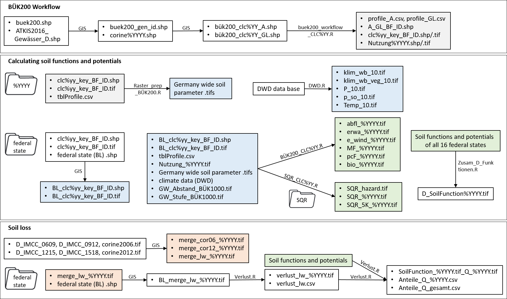

# rSOIL-DE

**Author:** Annelie Säurich  
**Date:** 10.10.2023  
**Language:** R Version 4.3.1  

# General info

The repository contains the scripts and necessary steps to implement the goals of the SOIL-DE project "Entwicklung von Indikatoren zur Bewertung der Ertragsfähigkeit, Nutzungsintensität und Vulnerabilität landwirtschaftlich genutzter Böden in Deutschland". The steps are:  

- Developping a general worflow to utilize the Bodenübersichtskarte 1:200.000 (BÜK200, BGR)  
- Calculating soil functions and potentials to evaluate the soil  
- Determining quantitative soil loss of agricultural soils  
- Determining qualitative soil loss of agricultural soils

Overview over all scripts and input parameters 

# Developing a general worflow to utilize the BÜK200 
[buek200_workflow_CLC%YY.R](buek200_workflow_CLC06.R)

In the BÜK200 database, a number of similar soil profiles (BF_ID) are grouped under one universal key (GEN_ID), which is connected to the shape file. 
The soil profiles and associated soil properties of each soil layer can be assigned by using the land-use mapped in the CORINE Land Cover (CLC, CLMS)inventory of 2006, 2012 and 2018. 
Before the [buek200_workflow_CLC%YY.R](buek200_workflow_CLC06.R) can be run the following data needs to be prepared:

**in GIS**

1. Clip the BÜK200 shape file and the ATKIS 2016 waterbodies shape file in GIS
2. Intersect BÜK200 and CORINE CLC%YYYY in GIS and filter Germany for Grassland (GL, Code 231) and Cropland (A, Code 211,221,222,242,243) and save as .shp ("bük200_clc%YY_GL" and "bük200_clc%YY_A.shp") and the columns tblZuordnu aka GEN_ID and CLC Code as .csv ("bük200_clc%YY_GL.csv" and "bük200_clc%YY_A.csv")

Now the script of the respective CLC year YY [buek200_workflow_CLC%YY.R](buek200_workflow_CLC06.R) can be used. This is what happens in the script:  

**in R**

1. Only GEN_IDs that are under Grassland or Cropland use according to CLC are considered in this workflow. All other GEN_IDs are ignored.
2. It is checked whether CLC%YY and GEN_ID land use match:  
Yes: the assignment workflow is continued.    
No: the main soil profile (BF_ID **1**) is used as soil profile, never mind the land use indicated.  
3. Assignment of suitable soil profile to GL or A land use:
- Take BF_ID **1** if there are matching.
- Otherwise use BF_ID with maximum area share (column FLANT_MITTELW)
- Or lastly, if the area share was the same for several BF_IDs, unsuitable soil profiles are sorted out (e.g. missing groundwater level or soil parameters) and ultimately one of these BF_IDs is randomly selected per GEN_ID.
Result: "Profile_A.csv" and "Profile_GL.csv" containing the assigned BF_IDs

To relate the assigned BF_IDs to the Germany are they need to joined in GIS:

 **in GIS**

 1. Join shape "bük200_clc%YY_A.shp" and "Profile_A.csv" and add column land use **1 for A** 
 2. Join shape "bük200_clc%YY_GL.shp" and "Profile_GL.csv" and add column land use **2 for GL**
 3. Merge both shape files to "A_GL_BF_ID.shp"
 4. Dissolve "A_GL_BF_ID.shp" by "BF_ID" to get "clc%yy_key_BF_ID.shp"
 5. Dissolve "A_GL_BF_ID.shp" by "land use" to get "Nutzung%YYYY.shp"
 6. Rasterize 4. and 5. to get "clc%yy_key_BF_ID.tif" and "Nutzung%YYYY.tif"

# Calculating soil functions and potentials to evaluate the soil
## Input data next to BÜK200
**Climate and topograhic data**  

- "Slope_10.tif" is the DGM10 grouped into 11 classes according to KA5  
- Calculate profile curvature "curv_prof.tif" and plan curvature "curv_plan.tif" using "Slope_10.tif" **in GIS**
- Prepare the needed climate data using [DWD.R](DWD.R)

**Water table depth**  
a lot of BF_IDs do not have information on water table depth  
missing information are gathered using the BÜK1000 water table depth "MNGW_10.tif"  
intersect of BF_ID and BÜK1000 information: "GW_Abstand_BÜK1000.csv" 

## General proceeding
- generation of the required grids Germany-wide [Raster_prep_BÜK200.R](Raster_prep_BÜK200.R)
- create a folder for the federal state
- Clip the "clc%YY_key_BF_ID" with the federal state border **in GIS**
- Use [BÜK200_CLC%YY.R](BÜK200_CLC06.R) to calculate soil functions and potential after Marks et al. (1992)
- Use [SQR_CLC%YY.R](SQR_CLC2006.R) to calculate the Müncheberg Soil Quality Rating (Müller et al. 2007)

## [Raster_prep_BÜK200.R](Raster_prep_BÜK200.R)  
generating Germany-wide .tif raster per soil profile and per soil horizon depending on the soil parameters  
- soil profile wise: water table depth in cm and classes and field capacity in mm and in classes, waterlogging, litter cover
- soil horizon wise: layer thickness, soil type class, bulk density, soil type, humus class, coarse soil

## [BÜK200_CLC%YY.R](BÜK200_CLC06.R)
**important:** replace the abbreviation of the federal state (e.g. BL <- "BB") in the whole script before starting
- before the calculation all relevant rasters are clipped to the federal state's borders  
- pH value rasters are generated

### Runoff-regulation function
- **"ab_GesMae.tif":** only upper 10 cm are used 
- **"ab_nr_hor.tif":** number of soil horizons used for the calculation   
- **"ab_Hor.tif":** evaluation of infiltration capacity using soil type class and coarse soil content for each soil horizon, then the weighted mean is calculated via horizon thickness 
- **"ab_nfk_O.tif":** evaluation of field capacity and additions due to litter layer  
- **"ab_neig.tif":** evaluation of slope gradient  
- **"abfl_%YYYY.tif":** evaluation of soil cover/land-use and subsequent cumulative result of intermediate steps

### Erosion resistance against water
- peat is not evaluated in Marks et al., but since peat has high erosion resistance against water they are evaluated as 5 (high)  
- same depth evaluated as in runoff regulation  
- **"BEW_Hor#.tif":** soil type related erosion resistance  
- **"korrBEW_Hor#.tif":** code from humus, coarse soil and BEW used for correcting the BEW (four digits, then two digits)
- **"korrBEW_Eaqua.tif":** corrected soil type related erosion resistance as weighted mean, calculated via horizon thickness  
- **"eaqua_w.tif":** influence of curvature  
- **"abtrag.tif":** determination of mean soil removal as a function of corrected BEW, slope gradient and summer precipitation  
- **"erwa_%YYYY.tif":** soil removal/erosion values after land-use-dependent correction 

### Erosion resistance against wind
- same depth evaluated as in runoff regulation and erosion resistance against water  
- **"ökoF/":** determination of the ecological moisture level using soil type class and groundwater level  
- **"eros_w_oM":** erosion resistance against wind for mineral soils depending on soil type, humus content and ecological moisture level  
- **"eros_w_hor":** erosion resistance against wind including peat dependent on peat type and decomposition  
- **"e_wind_%YYYY":** weighted mean of erosion resistance calculated via horizon thickness

### Mechanical filter function
- **"filter_GesMae.tif":** soil thickness of all soil horizons until ground water level  
- **"filter_nr_hor.tif":** number of soil horizons used for the calculation  
- **"mF_mittel.tif":** evaluation using soil type class as weighted mean calculated via horizon thickness  
- **"mF_zus_f.tif":** additions or reductions due to filtration section over groundwater level
- **"mF_klimWB.tif":** additions due to climatic water balance  
- **"MF_%YYYY.tif":** final evaluation

### Physical-chemical filter function
- same depth evaluated as in mechanical filter function  
- **"cF_mittel.tif":** evaluation using soil type class as weighted mean calculated via horizon thickness  
- **"cF_zus_f.tif":** additions or reductions due to filtration section over groundwater level
- **"pcF_%YYYY.tif":** final evaluation

### Biotic yield potential
- **"be_GesMae.tif":** only upper 30 cm are used 
- **"be_nr_hor.tif":** number of soil horizons used for the calculation  
- **"be_skel.tif":** evaluation of coarse soil content dependent on land-use as weighted mean calculated via horizon thickness  
- **"be_BAOB.tif":** evaluation of soil type class dependent on land-use as weighted mean calculated via horizon thickness  
- **"be_Naehr.tif":** evaluation of nutrient status using soil type and pH-value dependent on land-use as weighted mean calculated via horizon thickness 
- **"be_neig.tif":** evaluation of slope gradient dependent on land-use  
- **"be_GW.tif":** evaluation of groundwater level dependent on land-use  
- **"be_staunass.tif":** evaluation of waterlogging dependent on land-use  
- **"be_nFK.tif":** evaluation of field capacity dependent on land-use
- **"be_Temp.tif":** evaluation of mean annual temperature dependent on land-use  
- **"be_P.tif":** evaluation of annual precipitation sum dependent on land-use   
- **"be_erg.tif":** evaluation of erosion vulnerability  
- **"bio_%YYYY.tif":** minimal evaluation of raster cell is finale evaluation

## [SQR_CLC%YY.R](SQR_CLC2006.R)
### **Basic indicators** 
are scored by using scoring tables  
Single scores are on a quasi 5-ball scale ranking from best conditions (2) to worst (0) with possible increments of 0.5, or 0.25 in very sensitive cases  
they are dependent on land-use cropland/grassland  
- **Slope and relief** "SQR/hang.tif"    
- **Soil substrate** 
    - soil depth used for evaluation dependent on land-use  
    - cropland 80 cm: "sqr_GesMae_A.tif", "sqr_nr_hor_A.tif"   
    - grassland 50 cm: "sqr_GesMae_GL.tif", "sqr_nr_hor_GL.tif"
    - both together: "sqr_GesMae.tif", "sqr_nr_hor.tif"
    - "SQR/subst.tif": evaluation of substrate using soil type as weighted mean calculated via horizon  
- **Depth of A-horizon and depth of humic soil**
    - depth of A-horizon: A-horizons and top horizons including p "sqr_depth_A.tif"
    - depth ogf humic soil: dependent on humus content "sqr_depth_GL.tif"
    - "SQR/sqr_depth.tif": comcination of cropland and grassland
- **Aggregates and porosity / topsoil structure** 
    - evaluation after Diez&Weigelt (1997) using soil structure information  
    - peat evaluated according to bulk density
    - if soil structure is NA median is used
    - "SQR/top.tif"
- **Subsoil structure**
    - analogous to topsoil structure
    - "SQR/sub.tif"
- **Rooting depth**
    - calculating effective rooting depth via soil type and bulk density (KA5) "root.tif"
    - correction according to KA5 via land-use "We.tif"
    - "SQR/r_depth.tif": final evaluation
-  **Profile available water**
    - using field capacity [mm]
    - "SQR/PAW.tif"
- **Wetness and ponding (waterlogging)**
    - using groundwater level
    - "SQR/Wet.tif"
**"SQR/SQR_basic.tif":** cumulative indicator of all basic indicators  

### **Hazard multipliers** 
these properties are so critical for farming that they may limit the total
soil quality
- folder "SQR/hazard" needs to be created
- **Drought**
    - "sqr_drought_risk.tif": scoring drought risk using climatic water balance of the vegetation period (May-August)
    - "SQR/hazard/drought": evaluation based on drought risk and land-use
- **Acidification**
    - "sqr_pH.tif": scoring acidification using pH-value
    - "SQR/hazard/Sauer.tif": evaluation based on acidification and land-use
- **Soil depth above hard rock**
    - "sqr_hardrock.tif": using previously calculated rooting depth "We.tif" as approximate measure for scoring  
    - "SQR/hazard/hard_rock.tif": evaluation based on limitation free soil depth and land-use
- **Coarse rocks**  
    - "sqr_ske.tif": scoring rock at the surface using coarse soil content
    - "SQR/hazard/coarse_rocks.tif": evaluation based on coarse soil and land-use  

**"SQR/SQR_hazard.tif":** taking the minimal multiplier of all four hazard indicators  
**"SQR_%YYYY.tif":** multiplying basic indicator with hazard  
**"SQR_5K_%YYYY.tif":** grouped scores from 1 to 5

## [Zusam_D_Funktionen.R](Zusam_D_Funktionen.R)
combining all federal states to one Germany-wide soil function / soil potential .tif

# Determining quantitative and qualitative soil loss of agricultural soils

**in GIS**  
- **"merge_cor06_%YYYY.tif":** merge IMCC2006-2009 and IMCC2009-2012 with CORINE2006 into 2 bands (imcc, nutz) 
- filter CORINE2006.shp by cropland (Code 211,221,222,242,243) and grassland (Code 231) and split them in a new column (crops=1, grass=2)  
- **"merge_lw_%YYYY":** the merged rasters filtered by cropland (Code 211,221,222,242,243) and grassland (Code 231)   
- **"merge_cor12_%YYYY.tif":** merge IMCC2012-2015 with CORINE2012 into 2 bands (imcc, nutz)
- filter CORINE2012.shp by cropland (Code 211,221,222,242,243) and grassland (Code 231) and split them in a new column (crops=1, grass=2)  
- **"merge_lw_%YYYY":** the merged rasters filtered by cropland (Code 211,221,222,242,243) and grassland (Code 231)   
- create a folder for the federal state
- clip the "merge_lw_%YYYY" with the federal state border **in GIS**

## quantitative soil loss  
**in R**  
[Verlust.R](Verlust.R)  

- **important:** replace the abbreviation of the federal state (e.g. BL <- "BB") in the whole script before starting    
- **"verlust_lw_%YYYY.tif":** calculate new cover areas (IMCC=1) for every available time step  
- save separate and cumulative (2006-2012, 2006-2015, 2006-2018) time steps  
- **"verlust_lw.csv":** area shares of cropland and grassland

## qualitative soil loss 
[Verlust.R](Verlust.R)  
 
- collecting of all soil functions and potentials in one folder  
- **"SoilFunction_%YYYY.tif_Q_%YYYY.tif":** clipping soil functions and potentials with the four different "verlust_lw_%YYYY.tif"   
- **"Anteile_Q_%YYYY.csv":** calculation of area percentages per class and function/potential  
- **"Anteile_Q_gesamt.csv":** all four time steps together
